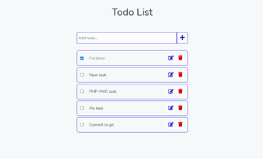

# Lara-Todo

This is a course that I took at Udmey, to create a todo website with Laravel and Vue.js

<p align="center">
    
</p>

## Start
First we need to download and setup <b>Composer</b>. After that we setup the project:
```shell
composer create-project laravel/laravel TodoList
```

After that we need to require the laravel ui:
```shell
composer require laravel/ui
```

And for the Vue we need to install artisan vue:
```shell
php artisan ui vue
```

After that open the <b>.env</b> file and set your database information init. Like database name, server, port ....

### Note
If you got the error "<i>No Application Encryption Key Has Been Specified</i>" just run the command bellow:
```shell
php artisan key:generate
```
Before using Laravel's encrypter, you must set a key option in your config/app.php configuration file.<br />
Click [here](https://laravel.com/docs/7.x/encryption#configuration) for more.

And for the final setup use the following command:
```shell
npm run watch
```

## Run
When you want to run the application, first you need to setup the server by the following command:
```shell
php artisan serv
```
This will create a local server for you.

And you need to run the following code for the front application:
```shell
npm run watch
```